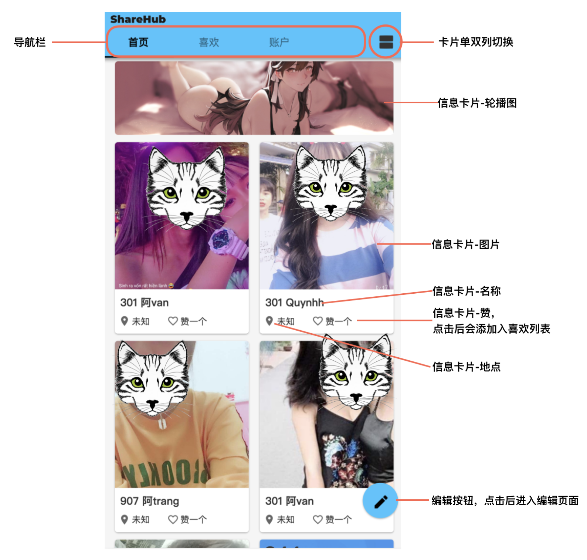
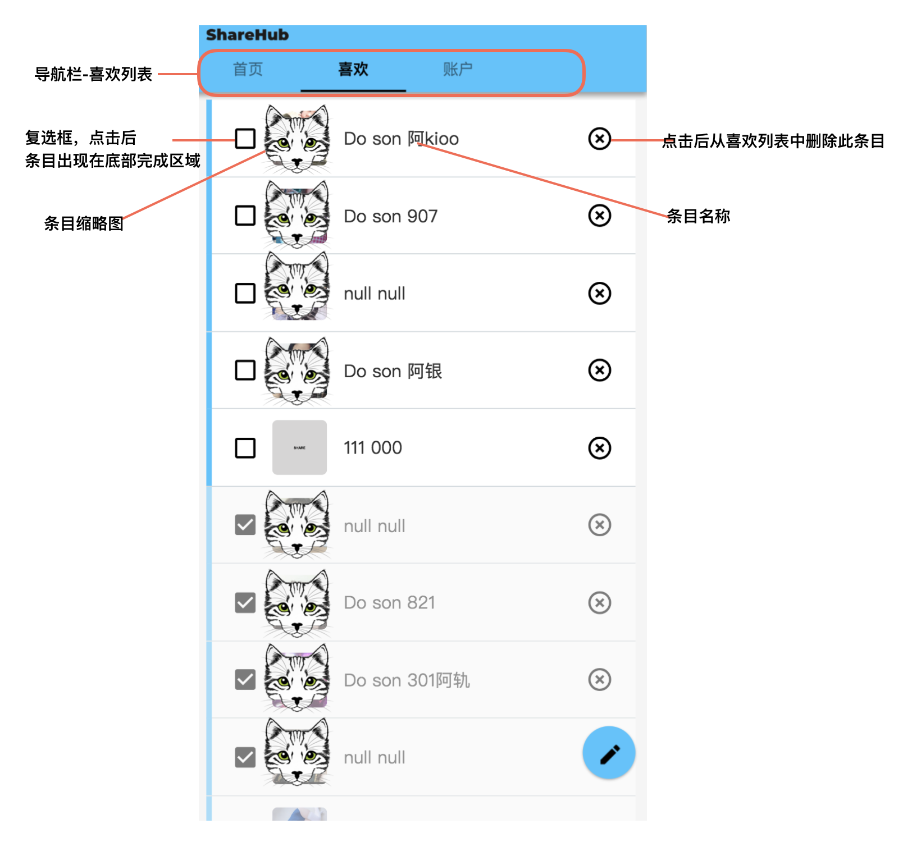
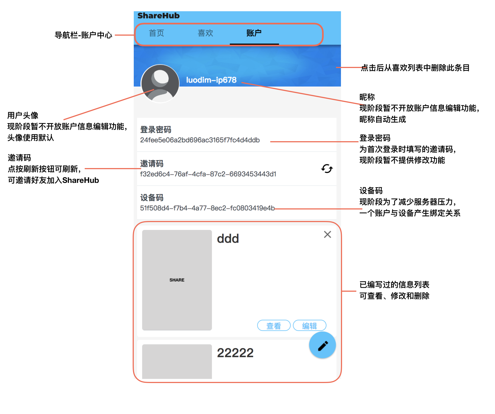
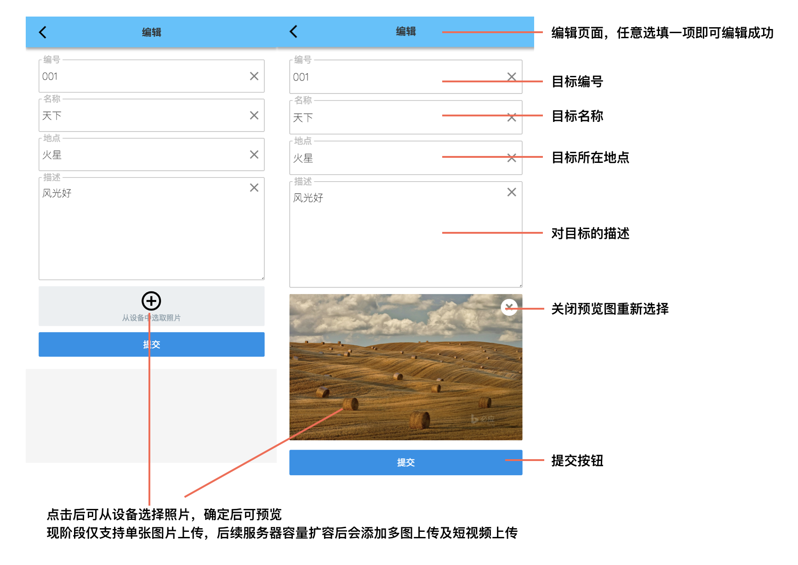
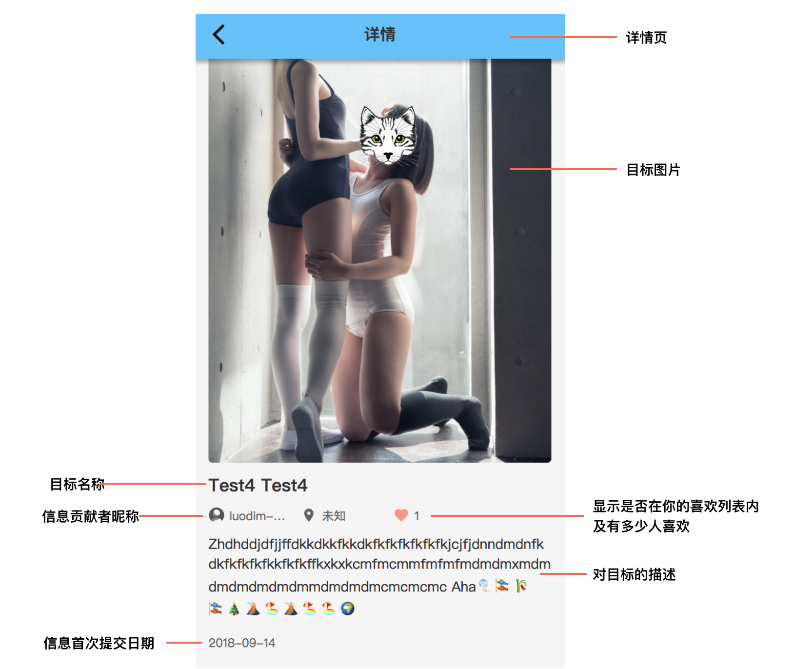

## 关于ShareHub
- ShareHub是什么
- 如何使用ShareHub
- 反馈与改进

#### ShareHub是什么
  ShareHub是一个信息分享平台，信息以卡片形式展现。每一位用户都是平台信息的使用者及贡献者。  
  当你发现了有意思的事物（目标）想与大家分享时，通过几个简单步骤即可生成一张包含目标信息的卡片，所有ShareHub的用户都可以看到你的分享。  

#### 如何使用ShareHub
- 首页  
  
- 喜欢列表
  
- 账户中心
  
- 编辑
  
- 详情
  

#### 反馈与改进
  目前ShareHub只是一个不成熟的平台，仅仅具备基础功能。后续会逐步完善优化。  
  如果在使用过程中发现各种问题或建议，欢迎发送反馈到<jhangyc@yandex.com>
